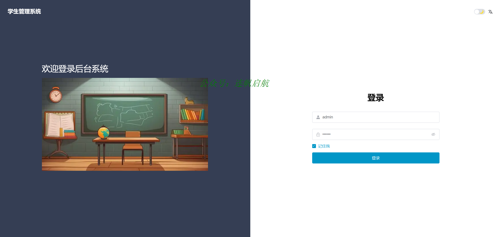

### 简介
为在校生和毕业生打造的学生后台管理系统，目前已实现功能：

主要功能有：
    - 学院管理
        院系管理
        专业管理
    - 班级管理
        班级信息
        课程表管理
    - 学生管理
        学生信息
        考试成绩
        家长管理
    - 教师管理
    - 课程管理
    - 通知公告
    - 系统管理
        用户管理
        角色管理
        菜单管理
        部门管理

### 核心技术
#### 依赖
- mysql5.7+
- jdk1.8+
- node.js
#### 前端
- npm
- vue
- element-ui
#### 后端
- springboot
- spring security
- redis
- mybatis
- mybatis-plus
- fastjson
- jwt

### 小程序截图
|||||
|---|---|---|---|
|||||
|---|---|---|---|
|||||

### 联系作者
 **微信：TL07061030** （备注gitee）

需要前后端源码，关注公众号 "连帆起航"，联系作者 领取！

